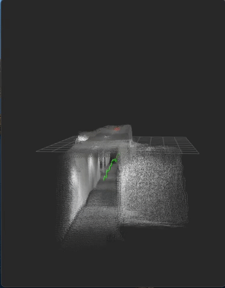
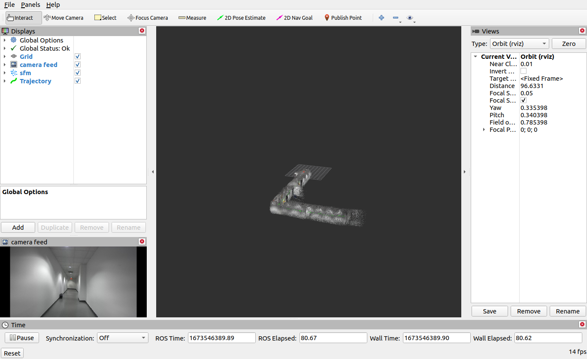

# Semantic Structure From Motion for Depth Cameras (ros_sfm)
Structure From Motion for ROS(noetic). Uses pcl and standard ros packages. Uses Libtorch and OpenCV for semantic segmentation.

<p float="center">
  
  
</p> 

## ⚙️ Setup
Dependeces (ROS, PCL, pcl_conversions, pcl_msgs)

### Libtorch *New*


1. Clone the GitHub repository into 'catkin_ws/src'
```shell
git clone https://github.com/jagennath-hari/ros_sfm.git
```
2. 'catkin build' and source the workspace.

## 🖼 Demo
Download [bag file](https://drive.google.com/uc?export=download&id=1SUDQQADDZAbozKulQ5Lv8tRqpfOsAcj8) and paste inside 'bag' folder in sfm.
To run a demo.
```shell
roslaunch sfm structure_from_motion_example.launch
```
## 🏁 To use
```shell
roslaunch sfm structure_from_motion.launch rgb_topic:=/rgb_topic depth_topic:=/depth_topic camera_topic:=/camera_topic odom_topic:=/odom_topic
```
### Topic inputs
- rgb_topic(sensor_msgs/Image)
- depth_topic(sensor_msgs/Image)
- camera_topic(sensor_msgs/CameraInfo)
- odom_topic(nav_msgs/Odometry)

## 📊 Visualization
Rviz can be used to view the topics '/sfm/cloud' and '/sfm/trajectory'.


### Published topics
- /sfm/cloud(sensor_msgs/PointCloud2)
- /sfm/trajectory(nav_msgs/Path)
